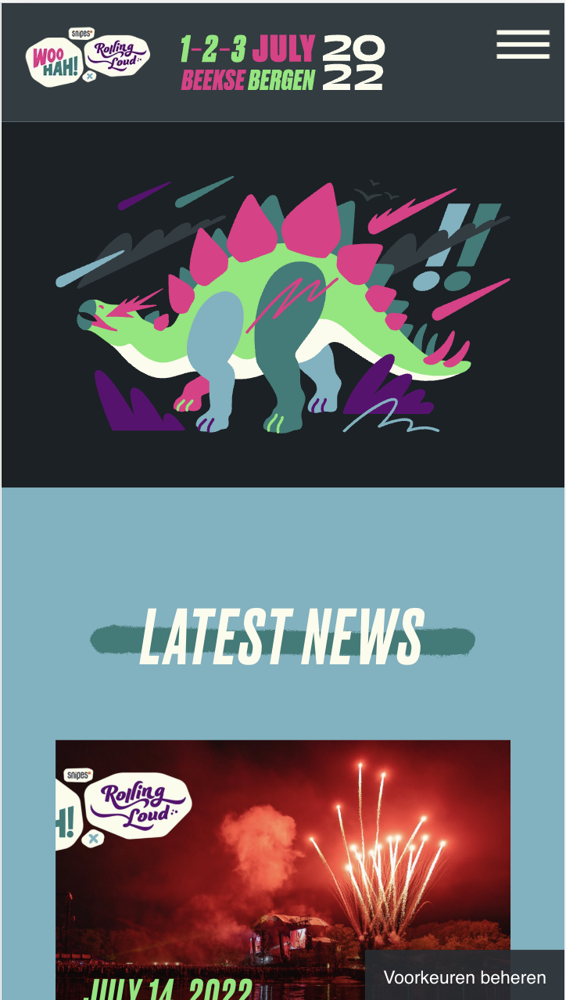
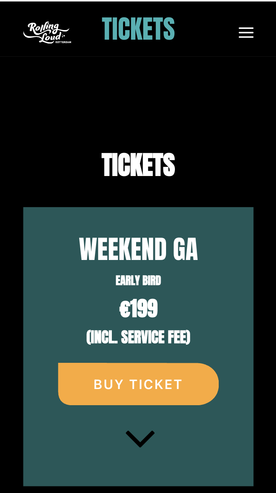
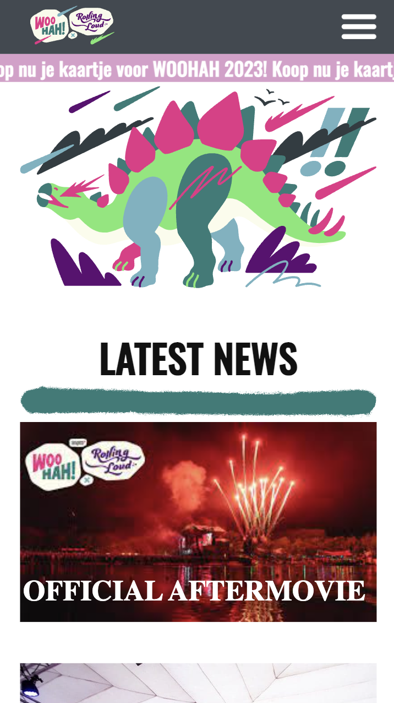
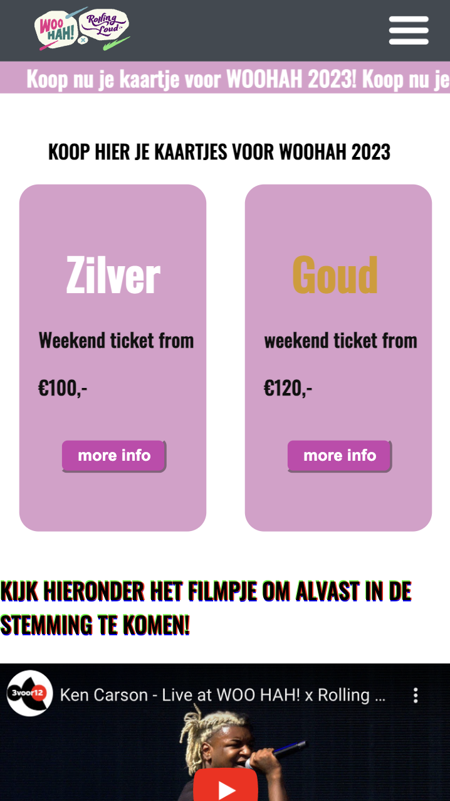

# Procesverslag
Markdown is een simpele manier om HTML te schrijven.  
Markdown cheat cheet: [Hulp bij het schrijven van Markdown](https://github.com/adam-p/markdown-here/wiki/Markdown-Cheatsheet).

Nb. De standaardstructuur en de spartaanse opmaak van de README.md zijn helemaal prima. Het gaat om de inhoud van je procesverslag. Besteedt de tijd voor pracht en praal aan je website.

Nb. Door *open* toe te voegen aan een *details* element kun je deze standaard open zetten. Fijn om dat steeds voor de relevante stuk(ken) te doen.

## Jij

  
uitwerken voor kick-off werkgroep

  ### Auteur:
  Mines Yetim(vervangen door jouw naam)

  #### Je startniveau:
  Blauw (kies uit zwart, rood óf blauw)

  #### Je focus:
  Surface plane (kies uit responsive óf surface plane)
 

## Je website

  
Ik ga de website van woohah namaken/leuker maken in mijn eigen stijl.

  ### Je opdracht:
  link naar de website die je gaat namaken óf de naam/omschrijving van je eigen ontwerp
  https://woohahxrollingloud.com/

  #### Screenshot(s) van de eerste pagina (small screen): 
  hi
  

  #### Screenshot(s) van de tweede pagina (small screen):
  hier de naam van de pagina  
  
 

## Toegankelijkheidstest 1/2 (week 1)

  
uitwerken na test in 1e werkgroep

  ### Bevindingen
  Lijst met je bevindingen die in de test naar voren kwamen:
  - dana kon met de brillen niet goed de website bekijken. Dit kwam omdat de achtergrond kleur op de woohah website zwart zijn waardoor het contrast weg valt van andere elementen op de pagina.
  - Je kon wel goed tabben door de website wat erg fijn was.
  - als je de website van browser naar telefoon veranderde veranderde veel aan de website.

  #### Screenreader
  Hier korte omschrijving (met indien nodig afbeeldingen)

  Hier een omschrijving van hoe het opgelost kan worden (met indien nodig afbeeldingen)

  Goede linkjes gebruiken in de website met een duidelijke alt tekst die goed samenvat wat je ziet 

  #### Muis en Toetsenbord 
  Hier korte omschrijving (met indien nodig afbeeldingen)

  Hier een omschrijving van hoe het opgelost kan worden (met indien nodig afbeeldingen)
- de buttons groter en duidelijker maken 

  #### Motoriek (shocks, elastiekjes)
  - Ik heb de test van Dana uitgevoerd en opzich gingen de tests met de elastiekjes wel goed.

  Hier een omschrijving van hoe het opgelost kan worden (met indien nodig afbeeldingen)
- de buttons groter en duidelijker maken

  #### Visueel (brillen, contrast, kleurenblind, dark/light). 
  - Het contrast van de woohah pagina is heel donker waardopr het heel lastig te zien was met de brillen. 

 - Ik kan de pagina met lichtere kleuren vormgeven zodat je ze gemakkelijk kunt bekijken en  (met indien nodig afbeeldingen)

## Breakdownschets (week 1)

  
uitwerken na afloop 2e werkgroep

  ### de hele pagina: 
  

  ### dynamisch deel (bijv menu): 
  

  ### wellicht nog een dynamisch deel (bijv filter): 
  

## Voortgang 1 (week 2)

  
uitwerken voor 1e voortgang

  ### Stand van zaken
  hier dit ging goed & dit was lastig (neem ook screenshots op van delen van je website en code)

  ### Agenda voor meeting
  samen met je groepje opstellen

  | student 1    | student 2          | student 3    | student 4        |
  | ---            | ---                | ---          | ---              |
  |             | ...                | ...          | ...              |
iedereen heeft apart vragen gesteld bij de studentassistent als deze er was. Ik had nog niet veel te laten zien omdat ik pas net aan mijn eindopdracht ben begonnen.

  ### Verslag van meeting
  hier na afloop snel de uitkomsten van de meeting vastleggen

  - Optijd beginnen met de eindopdracht 
  - Optijd hulp vragen wanneer nodig 

## Voortgang 2 (week 3)

  
uitwerken voor 2e voortgang

  ### Stand van zaken
  hier dit ging goed & dit was lastig (neem ook screenshots op van delen van je website en code)

  ### Agenda voor meeting
  samen met je groepje opstellen

  | student 1      | student 2          | student 3    | student 4        |
  | ---            | ---                | ---          | ---              |
  | dit bespreken  | en dit             | en ik dit    | en dan ik dat    |
  | en dat ook nog | dit als er tijd is | nog een punt | dit wil ik zeker |
  | ...            | ...                | ...          | ...              |

We hadden allemaal apart vragen gesteld aan de docent waar we vast liepen met onze website.
Ik was begonnen aan mijn eindopdracht en kon al wat laten zien gelukkig.
  ### Verslag van meeting
  hier na afloop snel de uitkomsten van de meeting vastleggen

  - optijd vragen stellen 
  - we kregen nog een soort peptalk van de docent dat we onze best moesten blijven doen en niet moeten opgeven daar ga 
  ik mij aan houden

## Toegankelijkheidstest 2/2 (week 4)

  
uitwerken na test in 8e werkgroep

  ### Bevindingen
  Lijst met je bevindingen die in de test naar voren kwamen (geef ook aan wat er verbeterd is):
  in de eerste toegangkelijkheids test kwam naar voor dat het voor slechtziende mensen lastig is om naar de website te kijken
  omdat die zo donker is. deze heb ik nu wot gemaakt de achtergrond en met vellere kleuren 

  #### Screenreader
  Hier korte omschrijving (met indien nodig afbeeldingen)

  Hier een omschrijving van hoe het opgelost kan worden (met indien nodig afbeeldingen)
- linkjes toegevoegd met een goede alttekst waar je doorheen kunt tabben.

  #### Muis en Toetsenbord 
  Hier korte omschrijving (met indien nodig afbeeldingen)

  Hier een omschrijving van hoe het opgelost kan worden (met indien nodig afbeeldingen)
- de buttons groter en duidelijker gemaakt 

  #### Motoriek (shocks, elastiekjes)
  Hier korte omschrijving (met indien nodig afbeeldingen)

  Hier een omschrijving van hoe het opgelost kan worden (met indien nodig afbeeldingen)
- de buttons groter en duidelijker gemaakt 

  #### Visueel (brillen, contrast, kleurenblind, dark/light). 
  Hier korte omschrijving (met indien nodig afbeeldingen)

  Hier een omschrijving van hoe het opgelost kan worden (met indien nodig afbeeldingen)
in de eerste toegangkelijkheids test kwam naar voor dat het voor slechtziende mensen lastig is om naar de website te kijken
  omdat die zo donker is. deze heb ik nu wot gemaakt de achtergrond en met vellere kleuren 

## Voortgang 3 (week 4)

  
uitwerken voor 3e voortgang

  ### Stand van zaken
  hier dit ging goed & dit was lastig (neem ook screenshots op van delen van je website en code)

  ### Agenda voor meeting
  samen met je groepje opstellen

  | student 1      | student 2          | student 3    | student 4        |
  | ---            | ---                | ---          | ---              |
  | dit bespreken  | en dit             | en ik dit    | en dan ik dat    |
  | en dat ook nog | dit als er tijd is | nog een punt | dit wil ik zeker |
  | ...            | ...                | ...          | ...              |

Iedereen heeft apart gepraat met de studentassistent en zijn eigen vragen gesteld.
  ### Verslag van meeting
  hier na afloop snel de uitkomsten van de meeting vastleggen

  - goed kijken naar de code
  - Hoe is de code genesteld
  - 

## Eindgesprek (week 5)

  
uitwerken voor eindgesprek

  ### Je uitkomst - karakteristiek screenshots:
  

  ### Dit ging goed/Heb ik geleerd: 
  Het was onwijs leuk om nieuwe dingen te doen met css en heb vooral geleerd hoe je goed
  dingen kunt aanspreken met nth of type bijvoorbeeld

  

  ### Dit was lastig/Is niet gelukt:
  alles is opzich gelukt

  

## Bronnenlijst

  
continu bijhouden terwijl je werkt

  Nb. Wees specifiek ('css-tricks' als bron is bijv. niet specifiek genoeg).

  1. 
  2. 
  3. 

